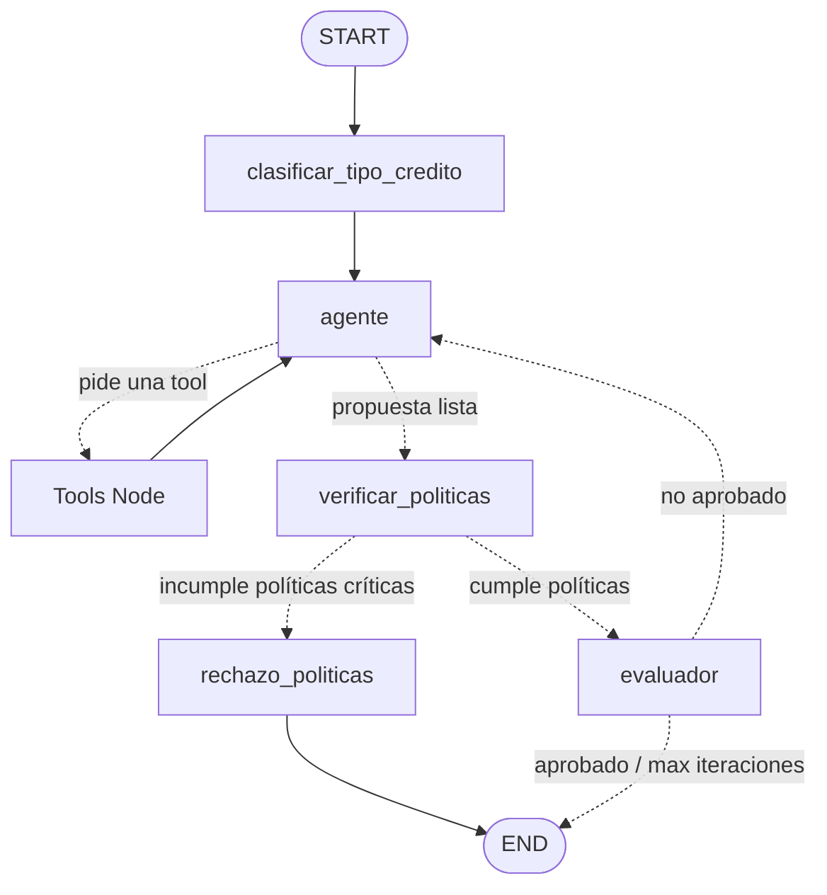

# B2B Asistente evaluador de riesgos de créditos

Este proyecto es un evaluador agentico de riesgo crediticio B2B desarrollado con LangGraph y LangChain. El sistema toma el perfil financiero de una empresa/persona solicitante, determina la viabilidad de la solicitud, calcula las condiciones financieras (tasas, plazos, mensualidades y montos máximos) de forma dinámica y genera una propuesta de comunicación formal tanto para el cliente como para el ejecutivo de cuenta, garantizando el cumplimiento estricto de políticas mediante guardrails deterministas en código y un bucle de evaluación-optimización.

## Arquitectura del Grafo

El sistema está diseñado de forma modular con los siguientes nodos y flujo lógico:



### Diagrama Visual de LangGraph

A continuación se muestra el diagrama visual de la arquitectura del flujo generado directamente por el servidor de desarrollo de **LangGraph Studio**:


---

### Detalle de los Nodos

1. **`clasificar_tipo_credito` (Router de Entrada):**
   Analiza el perfil inicial utilizando la API de salida estructurada del LLM para clasificar el tipo de crédito solicitado (`credito_comercial`, `prestamo_operativo`, `linea_revolvente`) y definir el tono de comunicación recomendado (`corporativo`, `conservador`, `flexible`). Escribe estos datos en el estado del grafo.
2. **`agente` (Agente ReAct):**
   El cerebro del flujo que decide secuencialmente qué herramientas llamar para recopilar datos del buró, evaluar capacidad de pago, cotizar tasas e intereses y calcular el monto máximo en caso de sobreendeudamiento.
3. **`verificar_politicas` (Guardrail Duro en Código):**
   Un nodo de validación determinista programado en Python (sin depender de la IA) que analiza el historial para comprobar que se cumplan las políticas de riesgo institucionales.
4. **`rechazo_politicas` (Salida Segura de Rechazo):**
   Si las políticas de seguridad fallan, este nodo genera una carta de rechazo oficial de forma automática y finaliza la ejecución sin pasar por el evaluador.
5. **`evaluador` (Bucle Evaluator-Optimizer):**
   Actúa como auditor independiente de calidad (LLM-as-a-judge). Califica la propuesta en base a 4 criterios (coherencia financiera, claridad, tono y gestión de riesgo) del 0 al 10. Si el promedio es inferior a 8.0 y no se ha alcanzado el límite de 3 intentos, devuelve la propuesta al agente con comentarios detallados para su optimización.

---

## Estructura de Respuestas Generadas

El sistema genera de forma paralela y coordinada dos tipos de respuestas:
1. **Respuesta para el Cliente (Formato Correo):** Agradece la confianza y presenta los términos del crédito de forma empática y formal (ya sea el monto solicitado original, el monto máximo ajustado por capacidad, o la declinación formal por buró/deudas).
2. **Respuesta para el Ejecutivo (Bitácora Interna):** Documenta paso a paso todos los datos fríos obtenidos: el score del buró de crédito, el análisis de riesgo, la capacidad mensual calculada, el plazo, la tasa asignada, los cálculos de mensualidad y la justificación de si se tuvo que ajustar el monto.

### Ejemplo Visual de Respuesta para el Cliente


### Ejemplo Visual de Respuesta para el Ejecutivo


---

## Políticas Críticas y Guardrails Duros

El sistema cuenta con un cinturón de seguridad triple programado directamente en Python:
* **Score de Buró Mínimo:** Se rechaza automáticamente si el score del buró de crédito es inferior a `500`.
* **Ratio de Endeudamiento Máximo:** Se rechaza automáticamente si la relación de gastos sobre ingresos del cliente supera el `65.0%` (`gastos / ingresos > 0.65`).
* **Auditoría de Respeto y Longitud:** Obliga al agente a reestructurar su respuesta si se detectan palabras no autorizadas, lenguaje invasivo o si excede las 300 palabras.

---

## Cómo Ejecutar el Proyecto

### Requisitos Previos

* Asegúrate de tener instalado el gestor de paquetes `uv`.
* Configura tus credenciales en el archivo `.env` (siguiendo el formato de `.env.example`).

### 1. Instalación de dependencias
```bash
uv sync
```

### 2. Ejecutar pruebas unitarias
Se ha implementado una suite completa de pruebas para las herramientas deterministas, la compilación de la estructura del grafo y la lógica de los guardrails:
```bash
uv run pytest
```

### 3. Ejecutar el Agente por Consola (CLI)
Puedes probar diferentes casos usando los siguientes comandos:

* **Caso Aprobado Directo (Bajo Riesgo):**
  ```bash
  uv run python main.py -p "RFC: ABC120304XYZ, credito comercial, ingresos: 100000, gastos: 30000, monto: 50000" --traza
  ```

* **Caso Aprobado con Ajuste de Monto (Capacidad de pago ajustada):**
  ```bash
  uv run python main.py -p "RFC: KLM030415A12, prestamo operativo, ingresos: 40000, gastos: 25000, monto: 150000" --traza
  ```

* **Caso Rechazo Automático por Guardrail (Score de buró deficiente):**
  ```bash
  uv run python main.py -p "RFC: ZXC010101QW1, credito comercial, ingresos: 100000, gastos: 30000, monto: 50000" --traza
  ```

### 4. Servidor de Desarrollo Visual (LangGraph Studio)
Para visualizar el grafo de forma interactiva y probar el flujo de nodos y estado en la interfaz gráfica:
```bash
uv run langgraph dev
```
