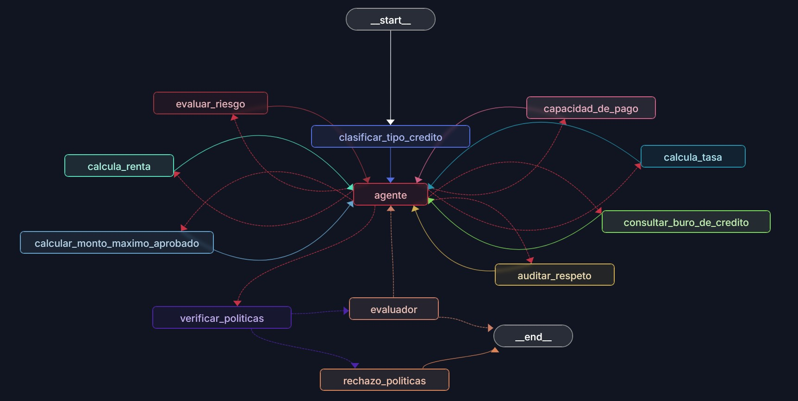
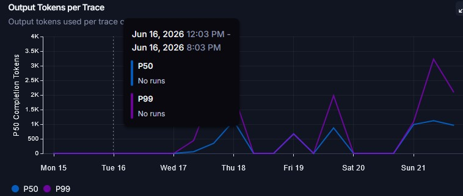
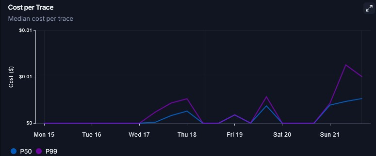
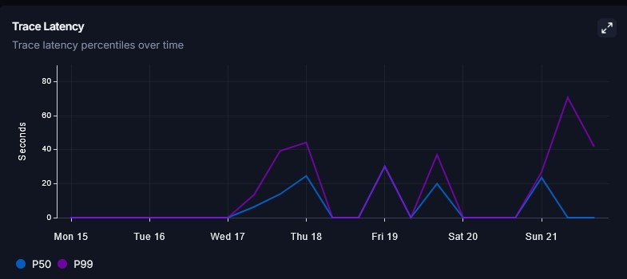

# B2B Asistente evaluador de riesgos de créditos

Este proyecto es un evaluador agentico de riesgo crediticio B2B desarrollado con LangGraph y LangChain. El sistema toma el perfil financiero de una empresa/persona solicitante, determina la viabilidad de la solicitud, calcula las condiciones financieras (tasas, plazos, mensualidades y montos máximos) de forma dinámica y genera una propuesta de comunicación formal tanto para el cliente como para el ejecutivo de cuenta, garantizando el cumplimiento estricto de políticas mediante guardrails deterministas en código y un bucle de evaluación-optimización.

## Arquitectura del Grafo

El sistema está diseñado de forma modular con los siguientes nodos y flujo lógico:


### Diagrama Visual de LangGraph

A continuación se muestra el diagrama visual de la arquitectura del flujo generado directamente por el servidor de desarrollo de **LangGraph Studio**:



---

### Detalle de los Nodos

1. **`clasificar_tipo_credito` (Router de Entrada):**
   Analiza el perfil inicial utilizando la API de salida estructurada del LLM para clasificar el tipo de crédito solicitado (`credito_comercial`, `prestamo_operativo`, `linea_revolvente`) y definir el tono de comunicación recomendado (`corporativo`, `conservador`, `flexible`). Escribe estos datos en el estado del grafo.
2. **`agente` (Agente ReAct):**
   El cerebro del flujo que decide secuencialmente qué herramientas llamar para recopilar datos del buró, evaluar capacidad de pago, cotizar tasas e intereses y calcular el monto máximo en caso de sobreendeudamiento.
3. **`verificar_politicas` (Guardrail Duro en Código):**
   Un nodo de validación determinista programado en Python (sin depender de la IA) que analiza el historial para comprobar que se cumplan las políticas de riesgo institucionales.
4. **`rechazo_politicas` (Salida Segura de Rechazo):**
   Si las políticas de seguridad fallan, este nodo genera una carta de rechazo oficial de forma automática y finaliza la ejecución sin pasar por el evaluador.
5. **`evaluador` (Bucle Evaluator-Optimizer):**
   Actúa como auditor independiente de calidad (LLM-as-a-judge). Califica la propuesta en base a 4 criterios (coherencia financiera, claridad, tono y gestión de riesgo) del 0 al 10. Si el promedio es inferior a 8.0 y no se ha alcanzado el límite de 3 intentos, devuelve la propuesta al agente con comentarios detallados para su optimización.

---

## Estructura de Respuestas Generadas

El sistema genera de forma paralela y coordinada dos tipos de respuestas:
1. **Respuesta para el Cliente (Formato Correo):** Agradece la confianza y presenta los términos del crédito de forma empática y formal (ya sea el monto solicitado original, el monto máximo ajustado por capacidad, o la declinación formal por buró/deudas).
2. **Respuesta para el Ejecutivo (Bitácora Interna):** Documenta paso a paso todos los datos fríos obtenidos: el score del buró de crédito, el análisis de riesgo, la capacidad mensual calculada, el plazo, la tasa asignada, los cálculos de mensualidad y la justificación de si se tuvo que ajustar el monto.

### Ejemplo Visual de Respuesta para el Cliente


### Ejemplo Visual de Respuesta para el Ejecutivo


---

## Políticas Críticas y Guardrails Duros

El sistema cuenta con un cinturón de seguridad triple programado directamente en Python:
* **Score de Buró Mínimo:** Se rechaza automáticamente si el score del buró de crédito es inferior a `500`.
* **Ratio de Endeudamiento Máximo:** Se rechaza automáticamente si la relación de gastos sobre ingresos del cliente supera el `65.0%` (`gastos / ingresos > 0.65`).
* **Auditoría de Respeto y Longitud:** Obliga al agente a reestructurar su respuesta si se detectan palabras no autorizadas, lenguaje invasivo o si excede las 300 palabras.

---

## Cómo Ejecutar el Proyecto

### Requisitos Previos

* Asegúrate de tener instalado el gestor de paquetes `uv`.
* Configura tus credenciales en el archivo `.env` (siguiendo el formato de `.env.example`).

### 1. Instalación de dependencias
```bash
uv sync
```

### 2. Ejecutar pruebas unitarias
Se ha implementado una suite completa de pruebas para las herramientas deterministas, la compilación de la estructura del grafo y la lógica de los guardrails:
```bash
uv run pytest
```

### 3. Ejecutar el Agente por Consola (CLI)
Puedes probar diferentes casos usando los siguientes comandos:

* **Caso Aprobado Directo (Bajo Riesgo):**
  ```bash
  uv run python main.py -p "RFC: ABC120304XYZ, credito comercial, ingresos: 100000, gastos: 30000, monto: 50000" --traza
  ```

* **Caso Aprobado con Ajuste de Monto (Capacidad de pago ajustada):**
  ```bash
  uv run python main.py -p "RFC: KLM030415A12, prestamo operativo, ingresos: 40000, gastos: 25000, monto: 150000" --traza
  ```

* **Caso Rechazo Automático por Guardrail (Score de buró deficiente):**
  ```bash
  uv run python main.py -p "RFC: ZXC010101QW1, credito comercial, ingresos: 100000, gastos: 30000, monto: 50000" --traza
  ```

### 4. Servidor de Desarrollo Visual (LangGraph Studio)
Para visualizar el grafo de forma interactiva y probar el flujo de nodos y estado en la interfaz gráfica:
```bash
uv run langgraph dev
```
---

## Observabilidad y Métricas (LangSmith)

El comportamiento de nuestro agente inteligente está totalmente monitoreado mediante la plataforma **LangSmith**. Esto nos permite analizar a detalle el rendimiento, consumo y costo del flujo. A continuación se presentan las métricas obtenidas durante una ejecución completa (Caso de aprobación con ajuste de monto):

### 1. Trazabilidad y Consumo de Tokens por Nodo

En esta gráfica se muestra el desglose del consumo de tokens en cada paso de la ejecución. Cada llamada a la API (clasificación inicial, las llamadas del agente ReAct y el nodo de evaluación) registra con precisión los tokens de entrada (prompt) y de salida (completion), permitiendo identificar cuellos de botella y optimizar la extensión de los prompts.

### 2. Desglose de Costo en la Traza de Ejecución

Muestra el costo financiero individual generado por cada invocación del modelo de lenguaje (`gpt-4o-mini`). El costo de cada llamada se calcula de forma dinámica según la cantidad de tokens consumidos, lo que facilita auditar financieramente qué partes del flujo (por ejemplo, el bucle de optimización o las llamadas del agente ReAct) tienen mayor impacto en el presupuesto.

### 3. Costo Total de la Invocación

Esta vista consolidada muestra el gasto total en dólares para una corrida completa del grafo de principio a fin. Gracias al uso de `gpt-4o-mini`, el costo total acumulado es extremadamente bajo (típicamente menos de un centavo de dólar por ejecución completa, incluyendo iteraciones de corrección), demostrando la viabilidad económica del sistema para un entorno de producción.

### 4. Latencia y Tiempos de Respuesta

Representa la duración en segundos de toda la ejecución del flujo de decisiones. Permite observar el tiempo que tarda cada nodo del grafo en resolver (las llamadas al LLM frente a las funciones deterministas en Python), ayudando a garantizar que los tiempos de respuesta cumplan con los Acuerdos de Nivel de Servicio (SLA) exigidos por la institución financiera.

---

## Decisiones de Diseño

1. **Separación de Responsabilidades (Modularidad):**
   Toda la lógica se dividió en archivos específicos para facilitar el mantenimiento y cumplir las buenas prácticas de producción:
   - `schemas.py`: Define de forma estricta los tipos de datos y los contratos Pydantic.
   - `tools.py`: Contiene las herramientas de cálculo financiero y consulta externa (score de buró, capacidad de pago, cotización y reducción de montos).
   - `prompts.py`: Concentra los templates de prompts del sistema (router, agente, evaluador).
   - `graph.py`: Define el estado, las transiciones y compila el flujo con LangGraph.
   - `main.py`: Punto de entrada de la interfaz de consola.

2. **Tipado Estricto y Pydantic:**
   Se utiliza tipado completo y validaciones robustas con Pydantic. Cada dato clave en el estado, así como el retorno de las herramientas, está estructurado con tipos nativos de Python y modelos Pydantic, eliminando el uso de `Any`.

3. **Guardrails de Código (Cinturón de Seguridad):**
    Las reglas críticas de riesgo institucional (score de buró < 500 o ratio de endeudamiento > 65%) se validan en un nodo determinista programado en Python puro. Si se violan estas condiciones, el sistema desvía el flujo inmediatamente a un nodo de rechazo, evitando consumir llamadas al LLM o al evaluador.

## Técnicas de Prompting Utilizadas

En el desarrollo de este agente inteligente se aplicaron de forma consciente las siguientes técnicas de Prompting:

1. **Few-Shot Prompting (Ejemplos Guiados):**
   * **Dónde se aplica:** En el prompt del agente (`SYSTEM_AGENTE` en `prompts.py`).
   * **Por qué y cómo:** Proporcionamos un ejemplo estructurado y detallado del reporte que debe generar para el ejecutivo de cuenta (mostrando el RFC, score de buró, capacidad de pago, tasas, mensualidades y justificaciones). Esto guía al modelo para estructurar el reporte de forma consistente y uniforme, hice esto porque cada vez que probaba cambiaba la salida y considero importante que los ejecutivos tenga TODA la información y que tenga siempre la misma estructura para que ellos se acostumbren y puedan consultarla de un solo vistazo sin perder tiempo teniendo que leer todo el contenido.

2. **Chain-of-Thought Prompting (Razonamiento Paso a Paso):**
   * **Dónde se aplica:** En el prompt del agente ReAct (`SYSTEM_AGENTE` en `prompts.py`).
   * **Por qué y cómo:** Indicamos al modelo: *"Sigue estrictamente este protocolo de ejecucion..."* y *"Razona brevemente antes de cada accion"*. Esto obliga al agente a descomponer el problema financiero en pasos lógicos consecutivos (razonamiento sobre el buró de crédito, análisis de riesgo, evaluación de capacidad y cotización), evitando errores aritméticos y asegurando que las decisiones estén fundamentadas.

3. **Zero-Shot Prompting (Directivas sin Ejemplos):**
   * **Dónde se aplica:** En el router de entrada (`SYSTEM_ROUTER`) y en el auditor (`SYSTEM_EVALUADOR`).
   * **Por qué y cómo:** Ambos componentes operan bajo una estructura de salida Pydantic rígida (`with_structured_output`). Al router se le definen las reglas categóricas de clasificación (`credito_comercial`, `prestamo_operativo`, `linea_revolvente`) y al evaluador se le definen los 4 criterios de la rúbrica (Coherencia Financiera, Claridad, Tono y Gestión de Riesgo), permitiendo que resuelvan la clasificación y auditoría de forma directa basándose únicamente en las definiciones conceptuales sin necesidad de ejemplos previos.

## La Parte Más Difícil y Cómo se Resolvió

La mayor dificultad técnica del desarrollo fue el **bucle Evaluator-Optimizer interactuando con el Agente ReAct** en múltiples ciclos de corrección. Cuando el evaluador rechazaba una propuesta (promedio de criterios < 8.0), el agente debía retomar la tarea y corregir el borrador inicial. Esto generaba dos problemas:
1. **Límites de Recursión en LangGraph:** Cada reintento implicaba que el agente ejecutara múltiples pasos internos (razonamiento + llamada a herramientas + observación), lo que agotaba rápidamente el límite predeterminado de recursión de LangGraph (25).
2. **Contexto de Corrección:** El agente necesitaba conocer el feedback del evaluador para refinar los cálculos financieros y el texto sin perder la consistencia ni entrar en un bucle infinito.

**Solución Implementada:**
1. Se ajustó el parámetro `recursion_limit` a 60 al invocar el grafo (`app.invoke`), lo que proporciona suficiente espacio para hasta 3 iteraciones completas del ciclo de evaluación y optimización.
2. Se diseñó un acumulador de feedback en el estado del grafo (`feedback_historial`) mediante un reducer. De esta forma, el evaluador guarda sus observaciones en una lista histórica.
3. El prompt del agente fue configurado para recibir y procesar dinámicamente este historial. Al reescribir la propuesta, el agente lee las observaciones anteriores, ejecuta de nuevo las herramientas de cálculo si es necesario y afina el contenido hasta cumplir la rúbrica institucional.

